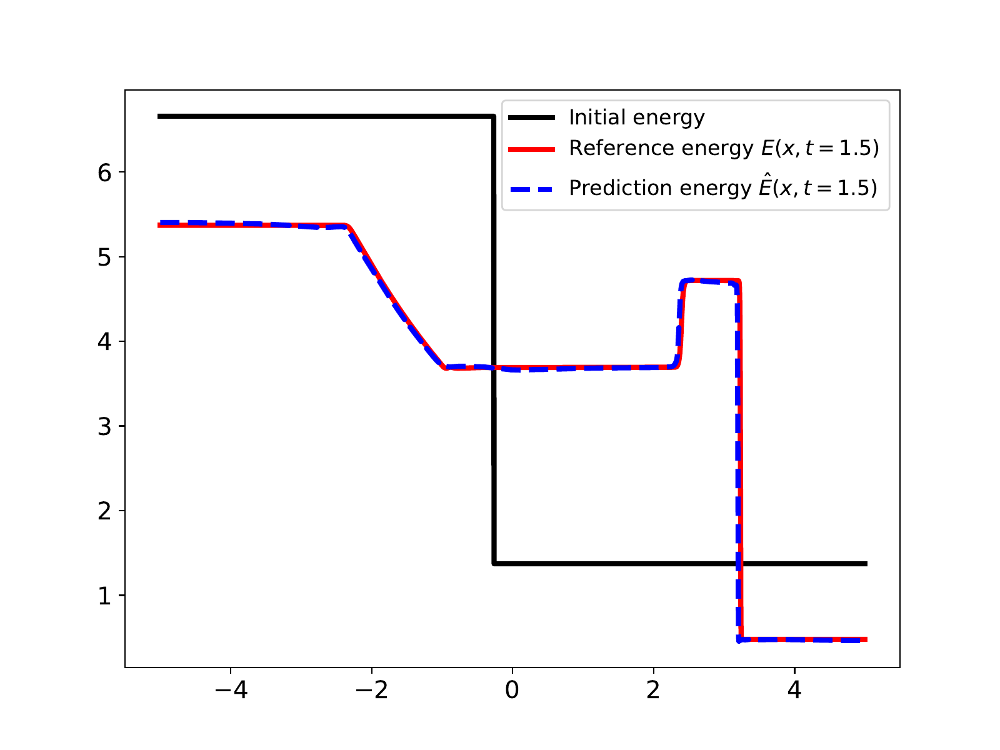

# Position-induced Transformer

The code in this repository presents six numerical experiments of using Position-induced Transformer (PiT) for learing operators in partial differential equations. PiT is built upon the position-attention mechanism, proposed in the paper *Positional Knowledge is All You Need: Position-induced Transformer (PiT) for Operator Learning*. The paper can be downloaded via <a href="https://arxiv.org/pdf/2405.09285">here</a>.

PiT is discretization convergent. On the Darcy2D benchmark, a PiT model trained with data at 43x43 resolution can produce accurate predictions given input data at 421x421 resolution.

<p align="center">
  
</p>

PiT can learn the dynamics governed by the incompressible Navier&ndash;Stokes equations, being potential for surrogate modeling of fluids motion. Left: reference vorticity at t=20. Right: predicted vorticity at t=20.

<p align="center">
  &nbsp;&nbsp;&nbsp;&nbsp;
</p>

PiT is able to approximate highly nonlinear operators. A PiT model can capture discontinuities displayed in the solutions of hyperbolic PDEs. Left: one-dimensional inviscid Burgers' equation. Right: one-dimensional compressible Euler equations.

<p align="center">
   
</p>

## Contents
- The numerical experiment on the one-dimensional inviscid Burgers' equation.
- The numerical experiment on the one-dimensional compressible Euler equations.
- The numerical experiment on the two-dimensional Darcy flow problem.
- The numerical experiment on the two-dimensional incompressible Navier&ndash;Stokes equations.
- The numerical experiment on the two-dimensional hyper-elastic problem.
- The numerical experiment on the two-dimensional compressible Euler equations.

## Data sets
We provide the <a href="https://drive.google.com/drive/folders/17h98Mqcjw7YVginrMj_rQ147pWiJHy6u?usp=sharing">preprocessed data sets</a>. The raw data required to reproduce the main results can be obtained from some of the baseline methods selected in our paper.
- For InviscidBurgers and ShockTube, data sets are provided in <a href="https://openreview.net/pdf?id=CrfhZAsJDsZ">Lanthaler et al.</a> They can be downloaded <a href="https://zenodo.org/records/7118642">here</a>.
- For Darcy2D and Vorticity, data sets are provided by <a href="https://openreview.net/pdf?id=c8P9NQVtmnO">Li et al</a>. They can be downloaded <a href="https://drive.google.com/drive/folders/1UnbQh2WWc6knEHbLn-ZaXrKUZhp7pjt-">here</a>.
- For Elasticity and NACA, data sets are provided by <a href="https://www.jmlr.org/papers/volume24/23-0064/23-0064.pdf">Li et al</a>. They can be downloaded <a href="https://drive.google.com/drive/folders/1YBuaoTdOSr_qzaow-G-iwvbUI7fiUzu8">here</a>.

## Requirements
- We have run the experiments on a linux OS, with `python==3.10.0`, `CUDA==11.8`, `tensorflow==2.10.0`, and `tensorflow_probability==0.18`. `matplotlib` and `scipy` are also needed for plotting and data loading.
- Since the version of `2.15.0`, Tensorflow supports installing its NVIDIA CUDA library dependencies through pip. This, for people who know both Tensorflow and PyTorch, represents a great improvement for Tensorflow. We provide the `requirements.txt` file

        --extra-index-url https://pypi.nvidia.com
        tensorflow[and-cuda]==2.15
        tensorflow_probability==0.23
        matplotlib
        scipy

    to facilitate running our code with `tensorflow==2.15.0` and `tensorflow_probability==0.23`. As long as the NVIDIA driver is up to date, simply run
    
    `python -m pip install -r requirements.txt`
    
    in an environment with `python>=3.9`. This will set up all the necessary dependencies, with no more need for manually installing CUDA stuff.

## Citations
```
@misc{chen2024positional,
      title={Positional Knowledge is All You Need: Position-induced Transformer (PiT) for Operator Learning}, 
      author={Junfeng Chen and Kailiang Wu},
      year={2024},
      eprint={2405.09285},
      archivePrefix={arXiv},
      primaryClass={cs.LG}
}
```
